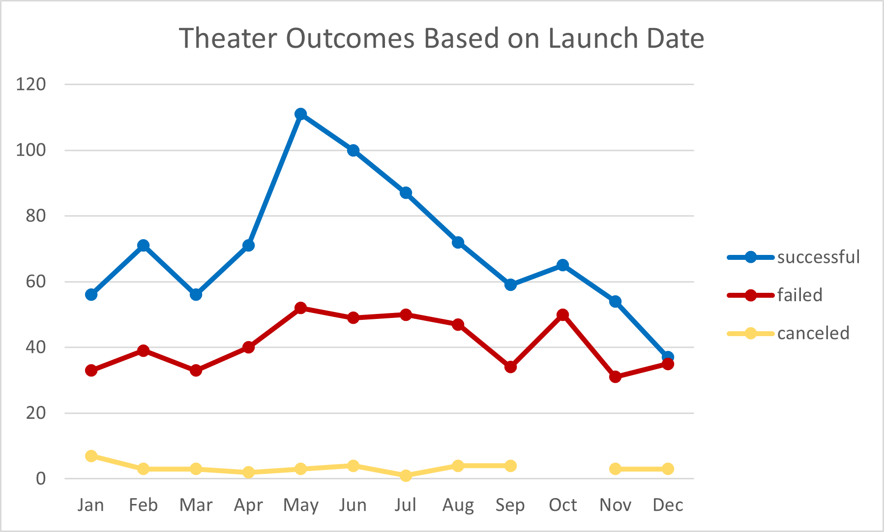
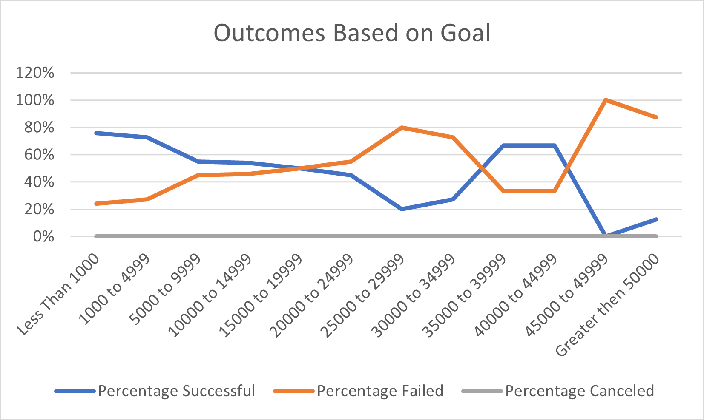

# kickstarter-analysis
Performing analysis on Kickstarter data to uncover trends 
## Overview of Project
Analysis of the outcomes of different campaigns  in relation to their launch dates and their funding goals
### Purpose
Using the Kickstarter dataset to know how different campaigns fared in relation to their launch dates and their funding goals
## Analysis and Challenges
In order to understand what makes campaigns successful, we looked at theater camping and at plays camping. We analyzed the outcomes based on a launch date for theater camping and outcomes based on goals for plays camping 
### Analysis of Outcomes Based on Launch Date

We can see that theater campaigns launched in May were the most successful Kickstarter campaigns and campaigns that launched in January, June, July, and October have the highest number of failed campaigns.

### Analysis of Outcomes Based on Goals

When are looking only at play campaigns, we can see that plays outcome dependent on the goal, campaigned with a goal under $14,999 have a better chance to succeed.

### Challenges and Difficulties Encountered
One of our challenges is to find the right goal for a successful campaign. That goal should be high enough to cover the needs but not too high so it will be a successful campaign. 
## Results
- Launch Date: 
  - It is recommended to launch the campaigns in May. Campaigns launched in May were the most successful Kickstarter campaigns.
  - Campaigns that launched in January, June, July, and October are most likely to fail.

- Campaign goal- camping with a goal under $5k has more chance to succeed, the higher the campaign goal the lower the success rate. 

- One of the limitations of this dataset is that we don't know the amount of each donation. The average donation can be affected by extreme data points that are not representative of the data we want.   Second, we don't know how each campaign was published and marketed and how it affects the outcomes.

- Other possible tables and/or graphs that we could create:
  - Descriptive Statistics- checking the Mean, Median, Standard Deviation, Upper and Lower Quartiles, and IQR of all the plays campaigns.
  - Reviewing campaigns by countries. 
  - How campaign length might be tied to its outcome.
